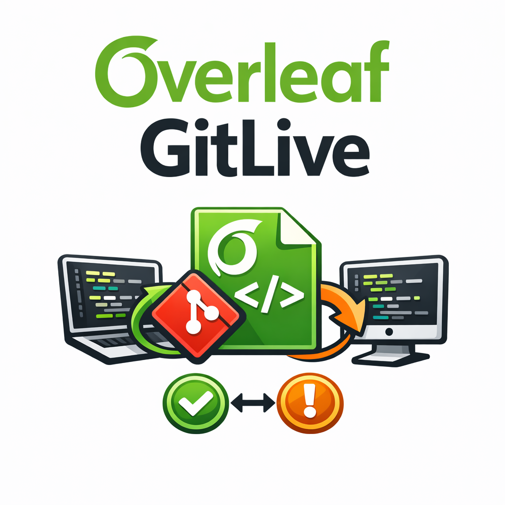

# Overleaf GitLive

<p align="center">
  
</p>

<p align="center">
  <strong>在 VS Code 中实现 Overleaf 项目的双向 Git 同步 + 远端 PDF 编译预览</strong>
</p>

<p align="center">
  <a href="README.md">English</a>
</p>

---

## 功能特性

- **Git 双向自动同步** — 检测本地文件修改，静默期后自动 commit & push；Overleaf 有新提交时自动 pull
- **智能冲突解决** — 本地与远端同时编辑同一文件时，打开交互式合并编辑器，使用 VS Code 原生的 Accept / Reject 按钮
- **远端 PDF 预览** — push 成功后自动触发 Overleaf 编译，在 VS Code 中显示 PDF
- **一键 Clone 项目** — 通过 Cookie 获取 Overleaf 项目列表，选择后自动 clone 并在新窗口打开
- **凭证安全存储** — Git Token 和 Cookie 存储在 VS Code SecretStorage 中，一次配置持久可用
- **侧边栏控制面板** — 启动/停止同步、触发 PDF 编译、解决冲突，全部在专用侧边栏中完成
- **LaTeX 格式化** — 内置 Prettier + unified-latex 格式化器，支持自定义行宽

## 快速开始

### 1. 配置凭证

按 `Cmd+Shift+P`（macOS）或 `Ctrl+Shift+P`（Windows/Linux）打开命令面板，执行：

- **`Overleaf GitLive: Configure Git Token`** — 输入 Overleaf Git token（从 Account Settings → Git Integration 获取）
- **`Overleaf GitLive: Configure Cookie`** — 输入 `overleaf_session2` cookie 值

### 2. Clone 项目

执行 **`Overleaf GitLive: Clone Project`**：

1. 插件使用已保存的 Cookie 获取项目列表
2. 选择项目 → 选择本地目标文件夹
3. 自动 clone 并在新窗口打开

### 3. 启动同步

在 Overleaf 项目目录中执行 **`Overleaf GitLive: Start Git Sync`**（快捷键 `Cmd+Alt+S`）：

- 本地修改在静默期（默认 30 秒）后自动 commit & push
- 协作者的远端提交自动 pull 到本地
- 状态栏实时显示同步状态和倒计时

### 4. 启动 PDF 预览

执行 **`Overleaf GitLive: Start PDF Preview`**：

- 每次 push 后自动触发编译并显示 PDF
- 手动刷新：**`Overleaf GitLive: Refresh PDF`**（快捷键 `Cmd+Alt+R`）

## 冲突解决

当你和协作者同时编辑同一文件时：

1. 侧边栏显示**冲突面板**，包含操作按钮
2. 点击 **Merge in Editor** 打开带有冲突标记的文件
3. 使用 VS Code 内联的 **Accept Current / Accept Incoming / Accept Both** 按钮逐处选择
4. 保存文件（`Cmd+S`）
5. 点击 **✅ Mark Resolved** — 插件立即 commit 并 push

其他选项：**Pull & Merge**（自动合并）、**Force Push**（覆盖远端）、**Terminal**（手动 git 操作）。

## Commit 标签与 Diff 语义

侧边栏使用固定 4 种标签：

| 标签 | 含义 | 典型场景 |
|------|------|----------|
| `current` | 有意义新增内容在当前 `HEAD` 中全部保留 | 该提交内容仍完全生效 |
| `partial` | 有意义新增内容只部分保留 | 后续提交只覆盖了其中一部分 |
| `overwritten` | 有意义新增内容被后续提交全部替换 | 历史未断，但这次提交新增内容已不再生效 |
| `orphaned` | 该提交不再位于当前 `HEAD` 祖先链路 | restore / rebase / force-push 改写了历史 |

快速区分：

- `overwritten`：提交还在当前历史里，但内容已被后续覆盖。
- `orphaned`：提交本身已不在当前历史里。

Diff 行为补充：

- **纯换行/空白变更会被视为非实质变更**，在状态判定和文件 diff 选择中会被忽略。
- 若所选范围仅包含纯换行/空白变更，插件会提示这些变更已被忽略。
- 多文件变更时会先弹出文件选择器，再决定打开哪些 diff。
- 多个已选 diff 会以独立固定标签页打开，不会被 preview 覆盖。
- 单个 commit diff 中，被后续覆盖的新增行会在右侧标记 ` [OVERWRITTEN LATER] `。
- 若该文件新增行被后续全部替换，diff 标题会标记为 `overwritten`；部分替换则标记为 `partial`。

## 所有命令

| 命令 | 说明 |
|------|------|
| `Clone Project` | 从 Overleaf 项目列表 clone 到本地 |
| `Configure Git Token` | 配置 Overleaf Git 认证 token |
| `Configure Cookie` | 配置 Overleaf session cookie |
| `Clear All Credentials` | 清除所有存储的凭证 |
| `Start Git Sync` | 启动双向自动同步 |
| `Stop Git Sync` | 停止同步 |
| `Start PDF Preview` | 启动 PDF 编译预览 |
| `Stop PDF Preview` | 停止 PDF 预览 |
| `Refresh PDF` | 手动触发一次编译 + 预览 |
| `Show Output Log` | 打开插件输出日志 |

所有命令均以 `Overleaf GitLive:` 为前缀。

## 配置项

| 设置 | 默认值 | 说明 |
|------|--------|------|
| `serverUrl` | `https://www.overleaf.com` | Overleaf 服务器地址 |
| `quietSeconds` | `30` | 最后一次编辑后等待的静默期（秒） |
| `pollSeconds` | `2` | Git 状态轮询间隔（秒） |
| `pdfPollSeconds` | `0` | PDF 定时轮询间隔；`0` = 仅 push 后触发 |
| `conflictStrategy` | `smart-merge` | 冲突策略：`smart-merge`、`always-ask`、`local-first`、`remote-first` |
| `ignorePatterns` | `[".*"]` | 同步时排除的 glob 模式（`.output*` 始终排除） |
| `formatter.enabled` | `true` | 启用内置 LaTeX 格式化 |
| `formatter.lineBreak` | `true` | 自动按行宽换行 |
| `formatter.printWidth` | `80` | 格式化行宽 |

所有设置前缀为 `overleaf-gitlive.`。

## 冲突策略详解

| 策略 | 行为 |
|------|------|
| `smart-merge` | 不同文件自动合并；同一文件冲突时暂停并打开合并编辑器 |
| `always-ask` | 远端有任何变更时都暂停询问 |
| `local-first` | 同文件冲突时保留本地版本 |
| `remote-first` | 同文件冲突时使用远端（Overleaf）版本 |

## 如何获取凭证

### Git Token

1. 登录 Overleaf → **Account Settings** → **Git Integration**
2. 生成或复制 token

### Cookie

1. 在浏览器中登录 Overleaf
2. 打开 DevTools（F12）→ **Application** → **Cookies**
3. 复制 `overleaf_session2` 的值

> **注意**：Cookie 有效期有限，过期后需重新配置。

## 开发

```bash
npm install
npm run compile
# 按 F5 在 Extension Development Host 中调试
```

### 项目结构

```
src/
  extension.ts        # 插件入口，命令注册
  gitSync.ts          # Git 双向同步引擎
  conflictHandler.ts  # 冲突检测
  conflictDiffView.ts # 交互式合并编辑器
  cloneManager.ts     # 项目 clone 管理
  sidebarView.ts      # 侧边栏 Webview UI
  pdfManager.ts       # PDF 编译与预览
  gitUtils.ts         # Git 命令封装
```

## 许可证

MIT
